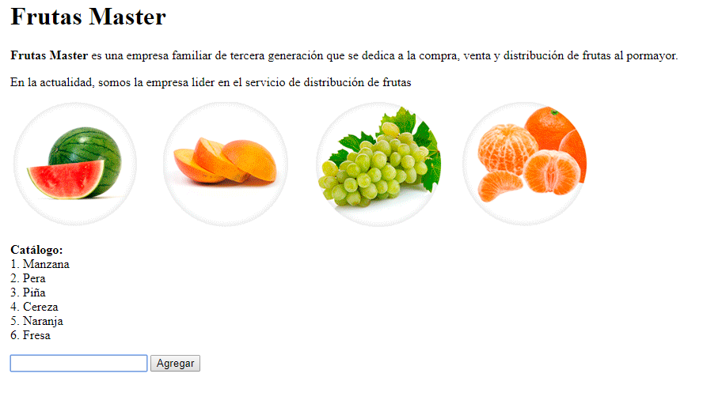
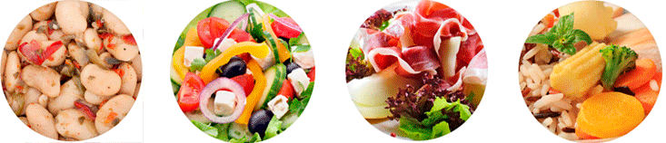

# lista-frutas
## Resultado

## Pasos

1 
2
3 En el HTML
  * Titulo: Frutas Master con tamaño de titilo h1
  * Comentario: **Frutas Master** es una empresa familiar de tercera generación que...
  * Insertar imagen (en este caso un gif)
  * Agregar un input (para insertar el nombre de la nueva fruta) y un button (para realizar la accion de agragar la fruta insertada)
  ````javascript
	<body>
		<h1>Frutas Master</h1>
		<p>
			<strong>Frutas Master</strong> es una empresa familiar de tercera generación que se dedica a la compra, venta y distribución de frutas al pormayor.
		</p>
		<p>
			En la actualidad, somos la empresa lider en el servicio de distribución de frutas
		</p>
		
		<p>
			<strong>Catálogo: <br></strong>
		</p>
		<p>
			<span id="frutaNueva"></span>
		</p>
		<script src="js/javascript.js"></script>
		<p>
	        <input type="text" id="ingresoFruta"/>
	      	<button onclick="agregarFruta()">Agregar</button>
	    </p>
	</body>
  ```
